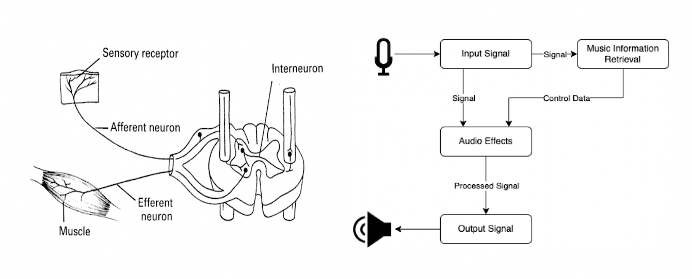
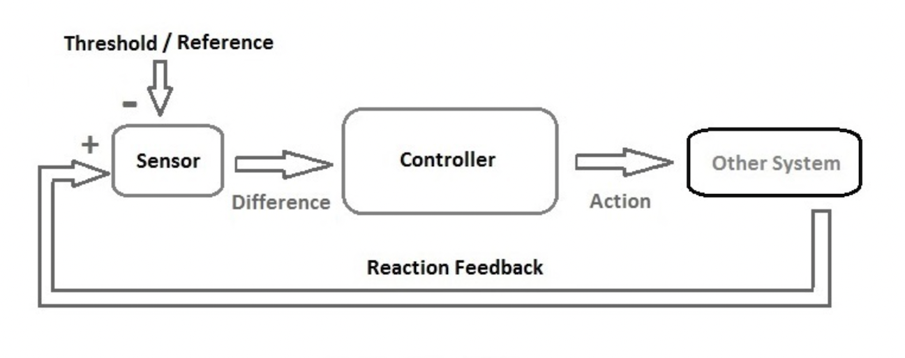
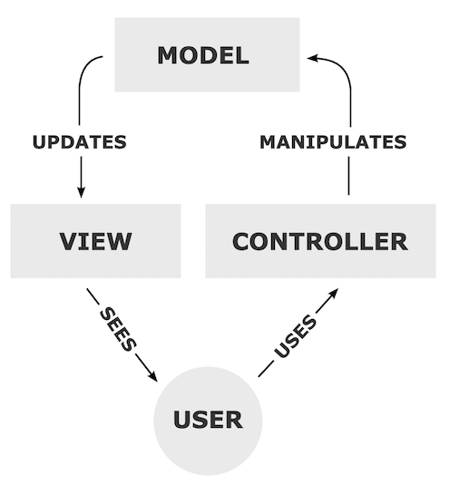
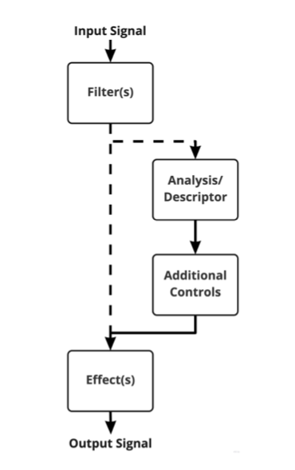
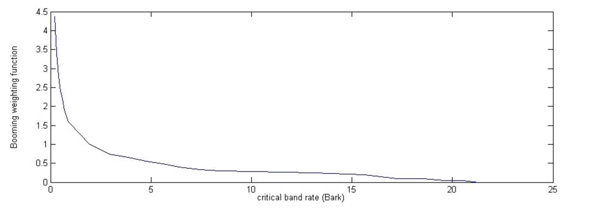
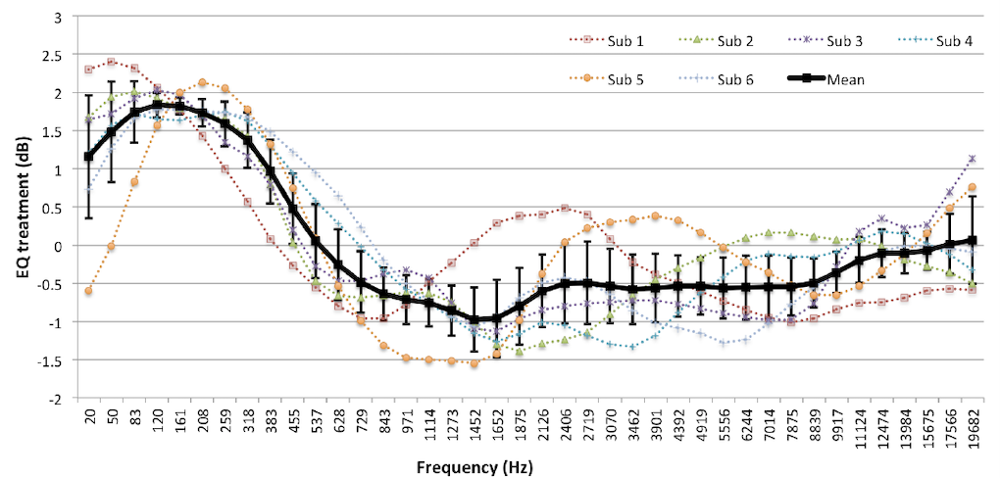
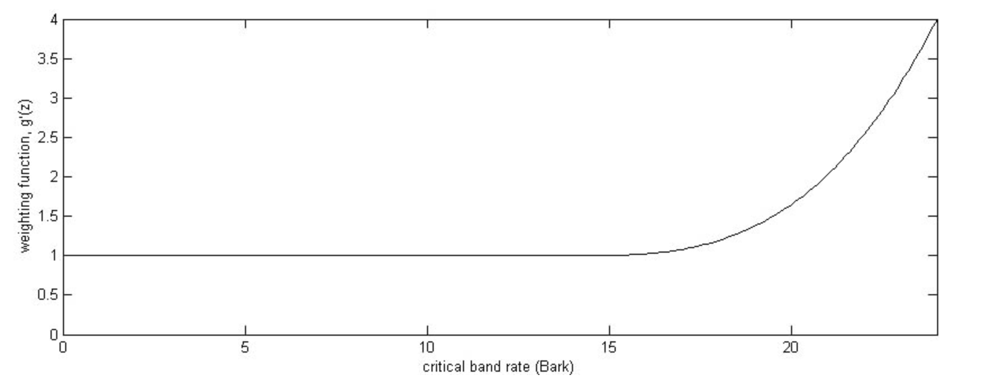
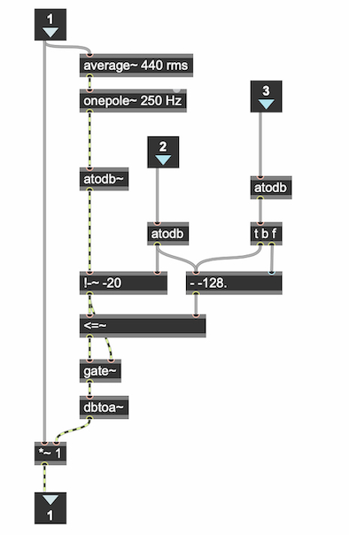

# Introduction

Automation in computer music is traditionally understood as an offline approach to controlling musical parameters over time, while Reflexive Automation views computer automation in a manner like classification and regression algorithms found in machine learning systems, which automate outputs based on training data and eventually inputs. However, reflexive systems do not require training. Instead, they respond to specific timbral features of live inputs through real-time analysis determined by the music information retrieval algorithm(s) implemented in the system. MIR algorithms use indirect acquisition of performance parameters from the incoming audio signal with a microphone. This is a non-invasive method (as opposed to direct signal acquisition which involves physical augmentation using sensors) for extracting parameters [@indirect]. By explicitly mapping the output of a real-time MIR algorithm to control an audio effect that is processing the same signal used for analysis, Reflexive Automation provides a blueprint for creating meaningful interactive musical systems between performers and computers.

Automation in music can refer to many things, but generally refers to any system that moves or acts of itself. Automated composition refers to a "formal process to make music with minimal human intervention” [@alpern]. This type of composition removes the composer from a large portion of compositional process; the composer only needs to invent the musical kernel for the composition. Many of the automated composition techniques utilize computers to generate choices based on predetermined rules or algorithms, such as the Illiac Suite by Lejaren Hiller and Leanoard Isaacson at the University of Illinois in 1956. Others, such as the music of Iannis Xenakis employ stochastic processes for generating various musical parameters. The difference between these two methodologies, rule-based and stochastic, is that in rule-based composition the computer makes decisions on behalf of the composer. On the other hand, stochastic processes only "aid the composer by virtue of its high-speed computations” [@cope]. A third category are systems that use artificial intelligence. These systems are like rule-based systems in that they are programs based on pre-defined datasets used for training. However, they have the added capacity to define their own rules while simultaneously providing high-speed computational aid.

In live electronic music today, automatic listening programs are popular for changing musical parameters. However, very few resources exist for aiding composers attempting to create with these tools. Many composers have developed their own complex approaches, such as Voyager by George Lewis [@voyager], but still there seems to be very little or no taxonomy of automatic listening techniques. There are several real-time MIR tools such as FluCoMa [@flucoma], FTM/Gabor Object Library [@gabor], MuBu [@mubu], and fiddle\~ and bonk\~ by Miller Puckette [@fiddle] in Max. Malt et al. developed Zsa.Descriptors, a collection of real-time sound descriptors for analysis in Max that includes models that can detect objective features such as the spectral centroid, spectral spread, and spectral roll-off using an FFT. These libraries do not provide additional filters, controls, or effects that can be used in conjunction with MIR tools. They require fluency in Max and rely heavily on built in objects. Additionally, Malt et al. describes the ``lack of knowledge of the relationships between descriptors and the pertinent perceptual characteristics of the sound for use in musical composition” as a factor in why MIR algorithms are rarely used in music composition [@zsa]. Musicians can sometimes further complicate this relationship by employing broad language. Another factor is that one descriptor is generally not useful for characterizing changes to complex spectra. The question of how to meaningfully and accurately describe a sound, purposefully retrieve data from that sound that relates to that description, and then use that data for a musical goal quickly becomes very challenging.

This research presents an approach and library for understanding and implementing real-time automatic systems, termed Reflexive systems, by framing automation as an automatic response to external stimuli, or a ``reflex,” rather than a user-supervised approach for producing change over time. Reflexive Automation, then, can be defined as any system that moves or acts of itself in relation to an external force. As opposed to automatic listening programs, reflexive systems are more concerned with the response from the system: the act of doing versus the act of listening. The degree of automatism or agency that exists within these systems is due to explicit mapping choices made by the composer. However, from the perspective of the performer it appears that the live electronics are fully autonomous. Reflexive Automation is intended to be used for creative purposes and may include for many alterations; it is a philosophy more than a recipe. It addresses the challenges stated above not only with new MIR tools but also with a conceptual framework for using these tools within a variety of musical contexts.

# Reflexive Automation

It is perhaps easiest to understand Reflexive Automation as the simultaneous use of automation, mapping, and music information retrieval in a system, the output of which results in a reflex that is the direct result of the input. The term reflex is used to communicate to performers that gesture, motor control, and physicality typically associated with many years of practice on an instrument are valuable and have expressive potential within these systems. Reflexive systems use information derived using MIR techniques from an audio signal and map it to audio effects parameters which are processing the same signal used for analysis. The way the effects or parameters change as a result of the input is determined by the mapping strategies utilized in the system. However, they typically fall into one of the following categories: one-to-one, one-to-many, many-to-one [@hunt].

The term Reflexive Automation is, in part, inspired by a biological reflexive system known as the patellar reflex test (Figure 1). In this analogy, the plexor is the incoming signal, or the action from which information is derived. Once the information is retrieved through contact with sensory neurons in the patellar, it is transmitted through the neuromuscular system and triggers an impulse in the motor neurons in the quadriceps muscles. The reflex arc occurs at the level of the spinal cord, meaning that the associated movement occurs without involvement from the brain. The result is a short jerk in the knee of the patient that happens automatically and involuntarily. It is an autonomous reaction that occurs as the direct result of a system of mapping of neurons in the body for the purpose of responding to external stimuli. In the context of computer music with live instruments, this conceives of audio processing as a gestural analog to the gestures of performers, as extensions of the sounds of their acoustic instruments. Like the rapid movement of the knee, the effect on the resulting sound changes as a response to the input, to the specific and unique sounds of the performance. The system must be designed to require no additional involvement or supervision from a controlling force to operate internally on the system, such as the composer or additional performers. In other words, it requires the absence of the involvement of the `brain.'

Reflexive systems can already be found in electronics and audio systems. For example, a microphone that clips does so in response to an input amplitude level that is too high to properly record. An over-driven amplifier results in distortion due to high gain levels that exceed voltage capacity. Systems such as these respond to changes to the input, regardless of whether the transfer functions of these systems are linear or nonlinear. All these systems utilize music information retrieval, albeit in a very non-purposeful manner, and a system of mapping that determines how the system automates or responds to the input.

## Affordances

Much live electronic music today requires performers to utilize several controllers, such as foot pedals, while playing their instruments. The often overly elaborate technical requirements and physical demands of live electronic music can create barriers for musicians. By relying on specific qualities of the sound of an instrument as the only external controller, the composer is inclined to become more sensitive to the technical demands of the performance and the performer will have a better working knowledge, through their instrument, of the system for which they are expected to interact. The only necessary hardware requirements currently are a laptop, audio interface, microphone, and speakers.

Computer programs used for live performance often require the performer to synchronize with a variety of cues, perform with a stopwatch and adjust the speed of their performance to arrive at a certain place in the score at a specific time, or perform alongside a track for which sometimes vague or unspecific graphic notation exists. These aspects of live electronic music can place the role of the performer as secondary, or as accompaniment, to the electronics. Failure with regards to live electronic performance in this context often means not performing the part “correctly” with regards to the score — meeting all of the synchronization points, alignment, etc. — and does not often refer to the subtleties of performance interpretation. Failure with regards to performing Chopin, for example, is related to the specifics of the interpretation, whether by tempo fluctuations (rubato), dynamic fluctuations, or other subtle distinctions not expressly notated in the score.

With regards to timbre, some notation exists such as sul ponticello and sul tasto on string instruments. Wind instruments can utilize a range of effects such as harmonics, multiphonics, noisier sounds such as flutter tonguing, and singing and playing simultaneously. Each of these has their own unique spectra and notation. Outside of this, performers have a wide range of terms that they use to classify the types of timbre that can be produced on their instruments, such as brightness and warmth. While these are perceived characteristics of timbre as opposed to a purely objective timbral analysis, they provide a useful common language for notation. When building reflexive systems, it is not necessary to include a separate notation for electronic elements in the score alongside the acoustic instruments, because the notation for the performer and the resulting electronic manipulation can be written using the same symbols or text. Text in the front matter of the score will suffice, in most cases, for conveying the behavior of the electronics to the performer.

# Related Concepts

Reflexive systems can be further understood in terms of cybernetics, a field concerned with causal circular feedback systems [@cybernetics]. Robert Wiener cites the steering of a ship as ``one of the earliest and best-developed forms of feedback mechanisms,” and the broad context for understanding these systems has made them useful in many disciplines [@wiener]. The notion of the sensor and controller is important to cybernetic systems. The sensor compares what is happening to a system with a standard of what should be happening, while the controller adjusts the behavior of the system. In the ship steering example, the helmsman adjusting the helm is the controller and the direction the ship takes based on that control input, water disturbance, crosswinds, and tide is the sensor. The helmsman is not in direct control of the ship, but rather in control of a complex system through a narrow set of inputs. The sensor-controller paradigm within cybernetics is what creates feedback in a variety of contexts. A simple cybernetic system is shown in Figure 2.

Reflexive systems create feedback loops through auditory responses by the performer based on outputs which are mediated by the specifics of the system, i.e., what descriptors, controls, and effects are implemented. The notion of listening and responding in real-time is an inherent aspect of music, particularly in improvisation. Like the steering of a ship, the choice of input must be made based on the current output from the system and how the sound is transformed by internal processes and subsystems. 

Building reflexive systems relates to paradigms found in software design for building applications. One example in web development is the Model-View-Controller Design Pattern [@mvc]. Software design patterns are templated, reusable solutions to commonly occurring problems within a given context in software design. On their own they cannot be transformed directly into source or machine code, but instead are blueprints for solving problems in many different applications and systems. Whereas most patterns address specific problems, the Model-View-Controller design pattern describes the architecture of a system of objects. The less clearly defined nature of the Model-View-Controller design pattern allows for broad applications in computer systems. It also plays an important role within information visualization [@sdp]. The Model-View-Controller design pattern is shown in Figure 3.

The user is crucial in both Reflexive Automation and the Model-View-Controller design pattern to interact with the system. In reflexive systems, the user controls the model with their instrument while the descriptors and other specific aspects of the system are hidden from the performers' view. The user in the Model-View-Controller design pattern can likewise input control data in various formats. The benefit of this pattern is that the user is presented with abstracted controls and is not required to interact with the full complexity of the system. Furthermore, the PnP.Maxtools library contains categories of objects that function together as a framework like design patterns. It is intended to provide a template for building reflexive systems, and the interchangeable nature of objects within each category facilitates experimentation and prototyping.

# PnP.Maxtools Overview

The PnP.Maxtools library\footnote{The package is currently available for download through the package manager in Max.} includes filters, timbral descriptors, controls, and effects that are designed for the real-time implementation of reflexive systems for music composition and improvisation. While most libraries in Max contain a set of similar objects based around a single tool or technique and provide many functions with that tool, the PnP.Maxtools package is designed as a framework using modular categories. While most objects in the package are novel, the effects are commonplace within the computer music paradigm. These include plate reverb, distortion, variable delay, and a real-time implementation of the famous Karplus-Strong plucked string algorithm [@pluck]. Figure 4 shows one possible configuration for the package categories. Each object from a category can be used interchangeably with others from the same category to create numerous interactions and resulting sounds. Additionally, more configurations of these categories are possible depending upon the mapping strategies, effects, and other objects used.

The goal behind creating categories of objects is to provide a strategy for building musical systems for music with live electronics. Many packages in Max provide a set of limited tools, but they often heavily rely upon the vast selection on built-in objects in Max. While this is generally considered a feature of third-party libraries rather than a bug, it can often be overwhelming for beginners and students. The categorical framework and `plug and play' style of the package is designed to be as user-friendly for Max users as possible. It is particularly geared towards beginning users and students, requiring no additional objects outside of the package for building reflexive systems. This is aided by additional package features, such as default arguments for all objects for general purposes and a preset frame size of 2048 samples for all descriptors which utilize an FFT. Additionally, the package launcher contains a demo where package objects can be randomly configured and techniques such as creating cooperative descriptors, effects chaining, and event detection functions are described in detail. Examples can be tested from within the demo then copied and pasted into another patcher and modified further. There are 43 objects in total.

## Filters

The filters provide pre-processing functionality and are intended to be used to restrict the range of frequencies or remove unwanted sounds from an audio signal before analysis. All of the filters are implemented using the pfft\~ object in Max using a frame size of 2048 samples.\footnote{This object in Max is a method for implementing a Fast Fourier Transform that manages windowing and overlapping needed to create a real-time Short Term Fourier Transform (STFT) analysis/resynthesis system.} These objects function by gating frequency bins, allowing certain ones to pass through the pfft\~ object unaffected while multiplying the real and imaginary values of other bins by zero. In the pfft\~ object subpatcher, the furthest right outlet of the fftin\~ object indexes the signal bin number and corresponds to the real and imaginary signals for that bin. Using a few boolean operators such as <\~, <\~, ==\~, etc. (“\~” denotes signal operators), it is possible to isolate any number of bins or bin regions for calculation.

## Descriptors

The timbral descriptors in the PnP.Maxtools package are a set of high- and low-level objective and subjective descriptors, the efficacy of which was evaluated through a study to determine the degree to which the output from these models align with perceived characteristics of that sound [@austin]. Additionally, evaluation of the PnP.Maxtools package was done using the Cranfield model for evaluating information retrieval systems [@cranfield]. One of the benefits of the PnP.Maxtools descriptors is that they output a normalized floating-point value between 0-1, where 0 corresponds to low perceived characteristics and 1 high perceived characteristics. With this standardization, it is possible to create cooperative descriptors, or descriptors created through the implementation of more than one descriptor simultaneously. For example, a particular sound may be best described as having both significant spectral roughness and depth. This will distinguish the sound from others which may correlate with significant spectral roughness or depth, but not both. This may be calculated using: *$D(n) = (Roughness*0.6)+(Depth*0.4)$* where *$(n)$* is the value at the *$nth$* index or frame. This section presents the newest additions to Max environment.

### pnp.boominess\~

A boomy sound is one that conveys a sense of loudness, depth, and resonance. Several boominess calculations have been proposed, such as the Booming Index as described by Shigeko Hatano and Takeo Hashimoto in "Booming Index as a Measure for Evaluating Booming Sensation” [@booming-index]. The method of calculation Hatano et al. propose makes use of the order analysis of a sound.\footnote{Order analysis is used to quantify noise or vibration in rotating machinery whose rotational speed changes over time. An order refers to a frequency that is a certain multiple of a reference revolution speed or r.p.m. of operation.} From this the fundamental frequency and harmonics can be determined and the loudness of these calculated. In Max, pnp.boominess\~ calculates the apparent boominess of an incoming signal based on the sharpness model described by Fastl and Zwicker in "Psychoacoustics: Facts and Models” [@boomy-sharpy]. However, Fastl et al. proposes that boominess is a measure of the low frequency content of a sound rather than high frequencies; the greater the proportion of low frequencies the greater the ‘booming’ sound. So boominess can be considered the opposite of the sensation of sharpness. Using Fastl and Zwicker's approach boominess can be calculated as:

$$\text{Boominess = }0.11\frac{{\displaystyle\sum_{n(0 Hz)}^{n(13,500 Hz)}}x(n)*gz(n)*z*0.1}{{\displaystyle\sum_{n(0 Hz)}^{n(13,500 Hz)}}x(n)0.1}$$

where *N* is the total spectral loudness, *g(z)* is the weighting factor for boominess as a function of the critical-band rate, and *dz* is a scaling factor. Only for critical-band rates less than 22 bark does the weighting factor increase from unity to a value of 4.5 at the end of the critical-band rate near 0 bark (Figure 5).

### pnp.depth\~

A deep sound is one that conveys the sense of having been made far down below the surface of its source. Whilst the attribute of depth is mentioned in several academic papers, only AudioCommons has proposed a model and suggested acoustic correlates [@acrelease]. However, an online experiment by Cartwright et al. called Social-EQ asked subjects to submit a timbral descriptor together with an appropriate setting on a 40-band graphic equalizer that demonstrates that descriptor [@cartwright]. Six subjects chose to submit the term deep. The 40-band equalization treatment submitted by each subject is shown in the Figure 6. The mean equalization of all subjects, and 95\% confidence intervals, are shown in the thicker black line.

There is a clear trend in Figure 8 that shows that all subjects’ EQ treatments emphasized the low frequency content of the signal. Since there is a large degree of commonality in these EQ treatments, it is likely that timbral depth is related to having emphasized low frequency content. Pearce suggests that a suitable model for depth would be to analyze: 1) the spectral centroid of the lower frequencies (energy pulling towards the low-end); 2) the proportion of low frequency energy; and/or 3) the low-frequency limit of the audio extract (the low frequency roll-on). The pnp.depth\~ implementation is a direct implementation of the model described by Pearce. It includes calculation of the lower spectral centroid and the ratio of energy between 30Hz and 200Hz compared to all energy up to the Nyquist frequency. The lower spectral centroid is calculated using:

$$\text{Lower Spectral Centroid = }\frac{{\displaystyle\sum_{n(30Hz)}^{n(200Hz)}f(n) x(n)}}{{\displaystyle\sum_{n(30Hz)}^{n(200Hz)}x(n)}}$$

where *$n(\omega)$* is the bin number relating to frequency *$\omega$*, *$f(n)$* is the frequency of the *$n$th* bin, and *$x(n)$* is the magnitude of the *$n$th* bin. The model also calculates the ratio of energy between 30Hz and 200Hz compared to all energy up to the Nyquist frequency:

$$\text{Ratio = }\frac{{\displaystyle\sum_{n(30Hz)}^{n(200Hz)}x(n)}}{{\displaystyle\sum_{n(0Hz)}^{n(Nyquist)}x(n)}}$$

where *n(Nyquist)* is the frequency relating to the Nyquist frequency.

### pnp.flatness\~

The pnp.flatness\~ object calculates the spectral flatness of each FFT frame.  The spectral flatness is used to quantify the tonal quality, i.e., how tone-like the sound is as opposed to being noise-like [@flatness]. Spectral flatness is defined by the ratio of the geometric mean to the arithmetic mean of the power spectral density components in each critical band. It is calculated as:

$$\text{Spectral Flatness = }\frac{\sqrt[n]{\displaystyle\Pi_{n(0Hz)}^{n(Nyquist)}x(n)}}{{\displaystyle\frac{1}{n}\sum_{n(0Hz)}^{n(Nyquist)}x(n)}}$$

where *$n(\omega)$* is the bin number relating to frequency *$\omega$*, *$n(Nyquist)$* is the frequency relating to the Nyquist frequency, and *$x(n)$* is the magnitude of the *n\textsuperscript{th}* bin. The Max implementation is a modified implementation of the model by Izmirli that performs calculations on each bin within a frame rather than on critical bands.

### pnp.hardness\~

A hard sound is one that conveys the sense of having been made (i) by something solid, firm, or rigid; or (ii) with a great deal of force. Although no explicit model of hardness exists in the literature, there is an indication that the attack and the spectral content of the attack determine the apparent hardness [@acfirst]. Research by Williams suggests that the onset portion of a sound determines the perception of hardness [@williams]. Additionally, Freed presents a model of mallet hardness perception for single percussive sounds with respect to four acoustic correlates: 1) spectral mean level (a form of long-term average spectrum, LTAS); 2) spectral level slope; 3) spectral centroid mean (mean spectral centroid over time, measured on the bark scale); and 4) spectral centroid TWA (time weighted mean of the spectral centroid) [@freed]. A model of hardness was developed by Pearce et al. which employs three metrics: (i) attack time; (ii) attack gradient; and (iii) spectral centroid of attack. The model calculates the attack gradient (difference in amplitudes of the attack start and end levels divided by the linear attack time) of the sound using a fixed attack time of 125ms:

$$\text{Attack Gradient = }\frac{a_{end}-a_{start}}{125}$$

where *a* is the amplitude relating to the attack of the signal. The attack spectral centroid is then calculated over the first 200ms before the attack and 125ms after the attack start, or until the next onset time if it happens before 125ms:

$$\text{Spectral Centroid = }\frac{{\displaystyle\sum_{n(0Hz)}^{n(Nyquist)}f(n) x(n)}}{{\displaystyle\sum_{n(0Hz)}^{n(Nyquist)}x(n)}}$$

where *$n(\omega)$* is the bin number relating to frequency *$\omega$*, *$f(n)$* is the frequency of the *$n$th* bin, and *$x(n)$* is the magnitude of the *$n$th* bin.

The implementation of hardness in Max is a modified version of the model proposed by Pearce et al. that calculates the attack gradient using a fixed attack time of 125 and the brightness\footnote{A brightness timbral descriptor, pnp.brightness\~, is available within the PnP.Maxtools library. This is a well known descriptor and not a new addition to Max. It is based on the brightness model developed by Pearce in "First prototype of timbral characterization tools for semantically annotating non-musical content."} and depth of the attack using the PnP.Maxtools descriptors previously described over the first 10ms before the attack and 125ms after the attack start [@acfirst]. This is done to capture as much of the period before the onset as possible without adding noticeable latency. The attack gradient, depth, and brightness are then scaled so the maximum value that can be returned from the model is 1.

### pnp.metallic\~

The pnp.metallic\~ object calculates the probability that an incoming sound is produced by a metallic source. Aramaki et al. identifies four timbre descriptors that are relevant signal features for the discrimination between sound categories: attack time, spectral bandwidth, roughness, and normalized sound decay. These are used to determine whether characteristics of a sound resemble that of sounds made by metallic objects. In general, metallic sounds contain rich and complex spectra relative to other sounds, such as those made by wooden or glass object [@controlling]. First, the spectral standard deviation is calculated with the equation:

$$\text{Spectral Standard Deviation = }\sqrt{\frac{{\displaystyle\sum_{n(0Hz)}^{n(Nyquist)}(f(n) -\mu)^2x(n)}}{{\displaystyle\sum_{n(0Hz)}^{n(Nyquist)}x(n)}}}$$

where *$\mu$* is the spectral centroid in hertz, *$n(\omega)$* is the bin number relating to frequency *$\omega$*, *$f(n)$* is the frequency of the *$n$th* bin, and *$x(n)$* is the magnitude of the *$n$th* bin. The normalized decay time is calculated by taking the absolute of the Hilbert Transform of the signal, followed by a low pass second-order Butterworth filter with a cut-off frequency of 50Hz [@hilbert]. The logarithm of this is taken after adding 1 to the result, which ensures that the logarithm of 0 is never calculated. This is expressed with the equation:

$$\text{Envelope = }\log_{10}((F(|H(x)|))+1)$$

where *$x$* is the audio signal, *$H(x)$* is the Hilbert Transform of *x*, and *$F(x)$* represents filtering of the signal. The roughness is then calculated using the method proposed by Vassilakis described below [@roughness]. The implementation in Max is a direct implementation of the model proposed by Aramaki et al., where the metallic probability of each FFT frame is calculated. Only the attack time was omitted from the calculation because the attack time is dependent upon the detection and analysis of onsets in the signal, making resonance and the gradual decay metallic sound more difficult to detect.

### pnp.roughness\~

A rough sound is one that has an uneven or irregular sonic texture. The pnp.roughness\~ object calculates the apparent roughness of an incoming audio signal using an FFT and Gen\~\footnote{Gen is an extension in Max that converts the patch into compiled C++ code that makes calculations at the audio sampling rate rather than the vector rate.} using the method proposed by Vassilakis [@roughness]. The term auditory roughness was first introduced in the literature by Helmholtz to describe the buzzing, harsh, raspy sound quality of narrow harmonic intervals [@helmholtz]. The dimension of dissonance correlating best with auditory roughness has been termed sensory or tonal dissonance [@tonal] or auditory dissonance [@consonance]. The Vassilakis Roughness model detects all peaks in the frequency spectrum for each frame where: (i) the magnitude of the frequency bin is greater than 0.01; (ii) the magnitude of the previous and next bins are less than the current bin; and (iii) in the frequency range between successive peaks the magnitude drops at least 0.01 below the magnitude of the lower peak. For each pair of peaks within a frame, the roughness is calculated with the equation:

$$r = 0.5X^{0.1}Y^{3.11}Z$$

with:

$$X = A_{min}*A_{max}$$

$$Y = \frac{2A_{min}}{A_{min}+A_{max}}$$

$$Z = e^{(-3.5s(f_{max}-f_{min}))}-e^{(-5.75s(f_{max}-f_{min}))}$$

$$s = \frac{0.24}{0.0207f_{min}+18.96}$$
  
where *$r$* is the roughness, *$A_{max}$* and *$A_{min}$* are the maximum and minimum magnitudes of the pair of peaks, and *$f_{max}$* and *$f_{min}$* are the maximum and minimum frequencies of the two peaks respectively.

### pnp.sharpness\~

A sharp sound is one that suggests it might cut if it were to take on physical form. The pnp.sharpness\~ object calculates the apparent sharpness of an incoming signal based on the model described by Fastl and Zwicker [@boomy-sharpy]. Closely related to sharpness, however inversely, is a sensation called sensory pleasantness. Fastl et al. defines a sound of sharpness 1 acum as "a narrow band noise one critical band wide at a centre frequency of 1kHz having a level of 60dB.” However, sharpness is a metric which has not yet been standardized. Consequently, there are several methods to calculate the metric including: Von Bismarck’s method [@von] introduces the idea of a weighted first moment calculation, Aures’s method [@aures] is a modified version of Von Bismarck’s equation, and Fastl and Zwicker's method which is a version of Von Bismarck’s equation with a modified weighting curve. Like boominess, sharpness has been used to partially quantify sound quality in examples such as measuring engine noise, and some domestic appliances such as vacuum cleaners and hair dryers. It has also been used in the calculation of a sensory pleasantness metric and an unbiased annoyance metric [@boomy-sharpy]. Using Zwicker and Fastl’s approach sharpness can be calculated as:

$$\text{sharpness = }0.11\frac{{\displaystyle\int_{0}^{24 Bark}N\text{'}g(z)z\text{ }dz}}{{\displaystyle\int_{0}^{24 Bark}N\text{'}\text{}dz}}accum$$

where *$N$* is the total spectral loudness, *$g(z)$* is the weighting factor for sharpness as a function of the critical-band rate, and \emph{dz} is a scaling factor. Only for critical-band rates greater than 16 bark does the weighting factor increase from unity to a value of 4 at the end of the critical-band rate near 24 bark (Figure 7). 

The AudioCommons implementation differs slightly from the above model. It windows the sound into frames of 4096 samples and then calculates the loudness of all 1/3 octave bands within the window up to the Nyquist frequency. The implementation in Max is similar, except that it uses an FFT to calculate the sharpness of each frame up to 13,500Hz:

$$\text{Sharpness = }0.11\frac{{\displaystyle\sum_{n(0 Hz)}^{n(13,500 Hz)}}x(n)*gz(n)*z*0.1}{{\displaystyle\sum_{n(0 Hz)}^{n(13,500 Hz)}}x(n)0.1}$$

with:

$$\text{gz = }\begin{cases}
   1 &\text{if } *n* \leq 2899 \text{ Hz}\\
   0.00012 * (z/10.0)^4 - 0.0056 * (z/10.0)^3 \\
   + 0.1 * (z/10.0)^2 -0.81 * (z/10.0) + 3.5 &\text{if } *n* \geq 2900 \text{ Hz}
\end{cases}$$

$$\text{z = }[v_1, v_2,..., v_n]$$
  
where *$n(\omega)$* is the bin number relating to frequency *$\omega$*, *$x(n)$* is the magnitude of the *$n$th* bin, *$v_n$* is the size of the FFT frame divided by 10, and *$gz(n)$* is the weighting factor for sharpness as a function of the critical-band rate. Only for critical-band rates greater than 2899Hz does the weighting factor increase from unity to a value of 4 at the end of the critical-band rate near 13,500Hz.

### pnp.warmth\~

A warm sound is one that promotes a sensation analogous to that caused by a physical increase in temperature. Several methods for calculating warmth have been proposed, all of which indicate that concentrated low spectral energy correlates with the perception of warmth. Pratt et al. proposes that a low spectral centroid and high energy in the first three harmonics above the fundamental frequency indicates that a sound is warm [@warmth]. The pnp.warmth\~ object calculates the apparent warmth of an incoming audio signal using a direct implementation of the the model described by Pearce et al [@acrelease]. This model calculates the spectral centroid of the mean warmth region:\footnote{As defined by Pearce et al., the mean warmth region is the area between the fundamental frequency and the fundamental*3.5.}

$$\text{Mean warmth region spectral centroid = }\frac{{\displaystyle\sum_{n(fund)}^{n(fund*3.5)}f(n) x(n)}}{{\displaystyle\sum_{n(fund)}^{n(fund*3.5)}x(n)}}$$

where *$fund$* is the fundamental frequency relating to the signal, *$n(\omega)$* is the bin number relating to frequency *$\omega$*, *$f(n)$* is the frequency of the *$n$th* bin, and *$x(n)$* is the magnitude of the *$n$th* bin. The model also calculates the ratio of energy between the mean warmth region compared to all energy up to the Nyquist frequency:

$$\text{Ratio = }\frac{{\displaystyle\sum_{n(fund)}^{n(fund*3.5)}x(n)}}{{\displaystyle\sum_{n(0Hz)}^{n(Nyquist)}x(n)}}$$

where *$n(Nyquist)$* is the frequency relating to the Nyquist frequency.

## Controls

The controls provide a wide range of functionality. Most objects in this category modify output values from descriptors to provide users with more control in terms of parameter automation or mapping. Several of these objects remove either low or high values to prevent unwanted noise, such as pnp.nozero and pnp.noone, while others smooth output values to prevent rapid value changes. The controls also provide easing functions to create non-linear mapping in reflexive systems.

Many of the sound descriptors are amplitude dependent, so they are more likely to output higher values if the amplitude of the incoming audio signal is higher. To prevent this, pnp.autoscale\~. (Figure 8) is designed to track the amplitude of the incoming signal and scale it towards a target amplitude value. The object is a modified version of the Adaptive Signal Level Scaling object proposed by Mikahil Malt and Emmanuel Jordan [@zsaevents]. The main difference is that pnp.autoscale\~ uses amplitude values from 0-1 as inputs, which allows it to be easily controlled by other objects from the package. The second inlet (the patch cable connected to the box labelled 2) sets the amplitude level to maintain, while the third inlet specifies the trigger threshold. When the amplitude value threshold from the third inlet is met, the object will scale the signal to the amplitude level specified by the second inlet.

# Conclusion and Future Work

Reflexive Automation is an interdisciplinary method for computer music automation that is defined as any system that moves or acts of itself in relation to an external force. It involve the simultaneous use of automation, mapping, and music information retrieval in a system and describes automation as part of a cybernetic system where real-time audio analysis tools implemented by the composer along with mapping strategies dictate inputs. The PnP.Maxtools library is a library of real-time objects for composers to build musical systems for music using live electronics as well as a design pattern used as a blueprint for using the library objects. The intimate relationship between the source of the sound and the proceeding effect on that sound is its primary point of concern, while reusability, customization, and abstraction is its secondary point of concern. The PnP.Maxtools package in Max is equipped with several categories: filters, descriptors, controls, and effects. Objects within these categories can be used interchangeably with others from the same category to build reflexive systems. The newest additions to the Max programming environment have been detailed along with research used when developing these models.

Future work will include creating a taxonomy of real-time MIR applications for music composition utilizing the PnP.Maxtools package and framework included in the PnP.Maxtools package launcher. This will provide a base upon which members of the Max community can build. New subjective descriptors, such as glass and wooden timbral estimators alongside more common tools like chord, key, and chroma analysis, are in development. By broadening the scope and applications of this software through new tools and designs, the PnP.Maxtools package will become more robust and better able to serve the needs of artists.

